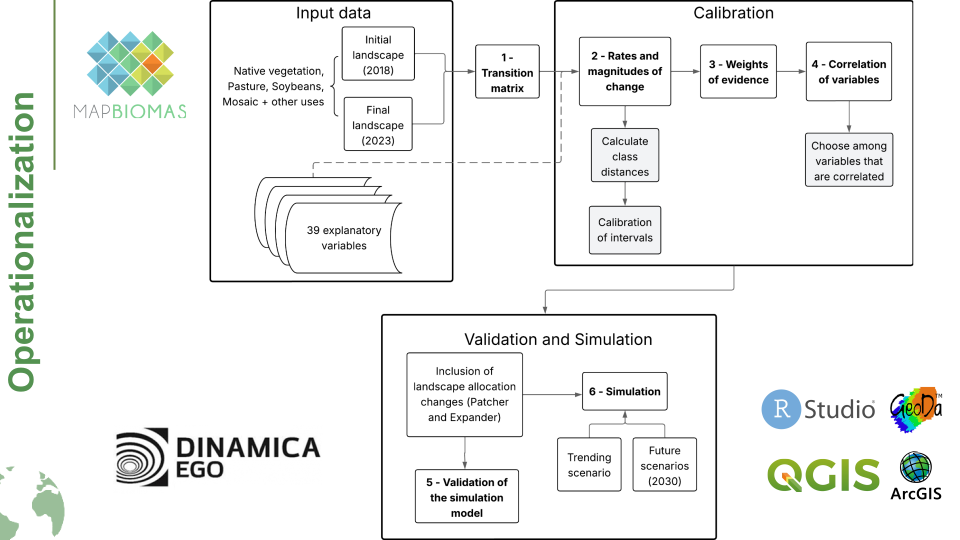
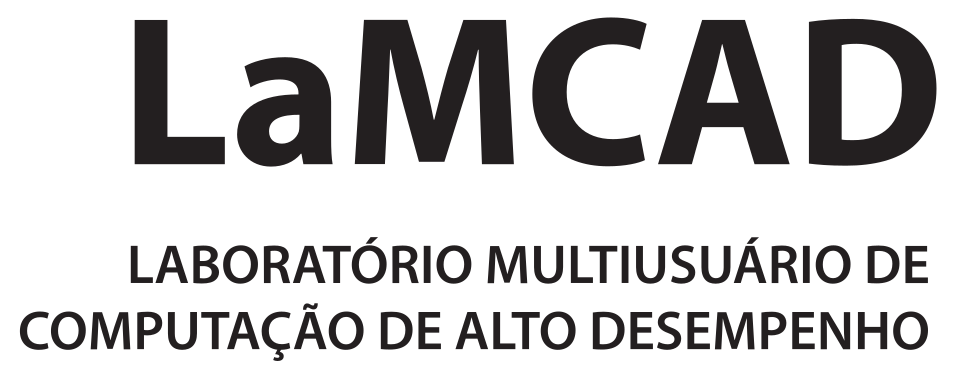

<h1 align="center"> Scenarios_Project / Projeto_Cenários</h1>

    

***

## Team

### LAPIG – Laboratório de Processamento de Imagens e Geoprocessamento (UFG)
- **Marisa de Oliveira Novaes**   
- **Alessandra Bertassoni**  
- **Guilherme Ramos Vaz** 
- **Laerte Guimarães Ferreira**  

### The Nature Conservancy (TNC)
- **Rafaela Albuquerque**  
- **Giovanni Mallmann**  
- **Arley Haley**  
- **Mario Barroso** 

<h2 align="left">Sumary</h2>

- [Introduction ](#introduction-)
- [Workflow](#workflow)
- [Acknowledgements](#acknowledgements)

***

## Introduction 

    The project’s central objective is to model scenarios of Brazil's agricultural intensification and remnant conservation, simulating future deforestation in the Amazon, Cerrado, and Pantanal biomes as a function of pasture and soy expansion. Additionally, the analysis of avoided deforestation is a key component for understanding the dynamics driving land-use transitions. This project is a joint initiative between the Image Processing and Geoprocessing Laboratory (LAPIG–UFG) and The Nature Conservancy.

Scenarios

a) Inertial Governance (Business-as-Usual – BAU):
Projects future land-use trajectories under the continuation of current environmental governance and enforcement levels, in which legal protection instruments coexist with implementation gaps and persistent environmental liabilities in Legal Reserves (RLs) and Permanent Preservation Areas (APPs), allowing for ongoing deforestation and land-use change within both legal and illegal margins.

b) Private Governance and Controlled Expansion (TNC-1):
Assumes the presence of a spatial control mechanism, potentially private (e.g., DCF), that restricts direct conversion of native vegetation and strengthens the protection of APPs and RLs, assessing whether spatial containment alone can alter vegetation loss trajectories.

c) Pasture Intensification and Optimization (TNC-2):
Maintains the configuration of TNC-1 while adding potential productivity gains from livestock intensification, thereby reducing the demand for new pasture areas. This scenario does not assume automatic regeneration, but evaluates how the combination of strengthened governance and improved productive efficiency can shift land-use conversion trajectories.

  

This repository contains the following:
- Data: [Input spatial data](Input_Data.md)
- Model: [Dinamica EGO model and required sub-models](Model_DinamicaEGO)
- Scripts: [R, JavaScript, Python, Shell scripts](Scripts)

 

## Workflow

    
    
<i>Figura 2: Dinamica EGO process.</i>

## Acknowledgements

| | |
|:---:|:---:|
|This research was supported by LAPIG/UFG|  |
|This research was supported by TNC|  |
|This research was supported by LaMCAD/UFG|  |

